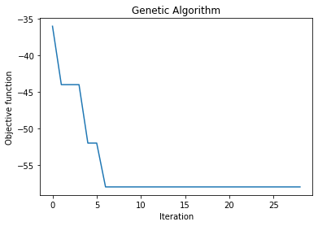
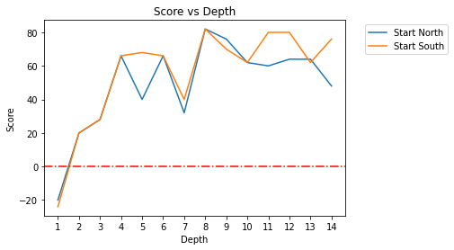

What you need to tell us:
1. what method you use (dont need to explain how it works)
    1. Alpha beta with heuristics
    1.
2. Any unique aspects
    1. written in rust: faster runtime so we can search deeper
    1. genetic algorithm to find weights
3. Any literature which has informed your decision process
4. what have you up to now achieved including evidence for quality (eg performance agaisnt test bots)
5. Any experiments used to inform decisions, or for evaluation
6. quantitative measures of performance (eg depth of seach, number of playouts per move, training time etc)
7. what you expect to have accomplished by submission
8. each member of the group should say something about the content, eg their contribution to the project


# Our approach
We used Alpha-Beta search guided by heuristics:
1. Difference between player's score and opponent's score
2. Difference between number of stones player can capture and number of stones opponent can capture
3. Difference between player's chaining potential (moves that allow the player to have a second turn) and opponent's chaining potential

# Unique aspects

## Rust
We chose to implement our bot in Rust (a systems programming language with compile time memory safey checks) to guarantee high performance vs Java or Python.

## Weights finding
We used a genetic algorithm library to find weights for our heuristic to maximise win margin when playing against the reference java agent.
<!--
We found a tool that allowed us to specify a cost function, and then run a genetic algorithm to (attempt to) find the maximum of that function. We made a function that takes the weights vector for our agent and then plays a game against a [????] test bot, and uses our score as the result.  -->



```
 The best solution found:
 [REDACTED]

 Objective function:
 -58.0
```
# Performance



